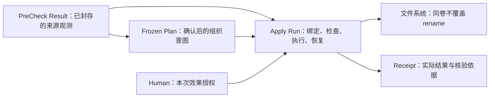

# Apply 的目的、安全与效率

本文件是本轮方案比较和开发交接的唯一设计入口。用户要求先厘清根本目的，再给出可选方案、现有实现的修改范围及 contract 判断；**用户已选择 B：同卷轻量核验，保留逐项持久化提交。本轮仅做设计，未修改产品实现或正式合约。** A/C 仅保留作比较，不属于本次开发范围。`docs/spec/contract/` 仍是当前承诺的权威位置。

相关事实已在[首次 Apply 验收](../../eval/sessions/260916-2258-first-apply-acceptance/report.md)取证：本次文件结果正确，但来源变化未拦截、确认来源未验证，整体验收未通过。本文不把一次成功或建议的安全边界写成新实现已通过。

## 1. 先确定根本目的

**Apply 的目的，是把已经确认的组织意图，忠实地变成可使用的目录结构，保留原文件，在可控成本下完成；出现中断时，能核对哪些效果已经发生，并安全地继续或交还处理。**

同卷 move/rename 是实现这个目的的主要技术手段。完整哈希、抽样指纹、文件状态检查、日志、同步和批次都各自解决具体问题，不因“更严格”就自动成为默认要求。

### 已由本轮对话明确的目标

| 目标 | 可验收的含义 |
| --- | --- |
| 忠实 | 成员、名称、目录层级和例外来自精确 Frozen Plan；执行期间没有新的分类或命名判断 |
| 原件保留 | 同卷改变目录项，保持同一文件对象；不重新编码媒体，不为了组织而复制媒体载荷 |
| 低 I/O | 正常同卷成本应主要随文件条目数量增长；避免随媒体总字节数重复扫描，不隐式转为复制删除 |
| 稳定 | 所有可能的效果都有可恢复的意图和结果；重试不重复移动，中断不把未确定结果算成完成 |
| 安全 | 不覆盖、不擅自替换来源、不越出确认范围；已知不满足条件时停止，而非猜测或放宽条件 |
| 少打扰 | 人类决定整批效果与实质风险变化；工具内部逐项检查不变成逐文件确认 |
| 可核对 | 成功、失败、未执行、不确定分别交代；回执能追溯实际结果及撤回条件 |

正常负载包括几万项媒体及大量 sidecar，小文件不是可以排除的边缘情形。性能设计中的条目数 N 包含 Frozen Plan 中全部待移动文件；sidecar 仍须属于冻结范围，不能由 Apply 临时猜测并捎带移动。

### 已选核验边界与恢复声明

用户选择 B，确定本次沿用旧有限指纹检查来源、以准备时的文件对象状态约束后续效果，取消正常同卷路径的反复完整内容读取。文件身份、位置、不覆盖、逐项持久化日志和恢复检查仍需保留。默认不承诺发现所有隐蔽字节变化。

选择 B 不意味着降低现有持久化强度，也不等于已经认证突然断电恢复。本文保留持久化意图和结果；进程崩溃、系统重启、突然断电及物理介质损坏分别验收，不相互代替。本轮未另外确认扩大掉电认证范围，不能将未验证的能力写成安全改善。

完整存储健康巡检、发现所有隐蔽字节损坏、长期备份和任意外部程序并发改写，是额外的目标或运行条件。它们不能通过多调用几次 hash 就被一并保证。如果用户将这些纳入根本目的，应重选保证和成本范围。

## 2. 目的、权威与实现手段



| 责任 | 权威位置或承担者 | 技术手段可以怎样改变 |
| --- | --- | --- |
| 原始事实及旧来源依据 | 原媒体；精确 Result 中的 Observation、locator、basis、qualification | 可替换状态采集和指纹算法；不能在读取旧 Result 时注入“现在才读到”的旧证据 |
| 要整理谁、去哪里、叫什么 | Frozen Plan | 可压缩 Source Set 的表达；不能在冻结后重新解释或改写已确认字节 |
| 是否允许本次效果 | Human 或已有明确委托，通过可信 Host 上下文绑定 Run | 可使用客户端确认机制；普通 Agent 参数不能自证人类身份 |
| 准备、效果、幂等、恢复 | Apply Run 和确定性 Tool | 可调整连接、并发、批量、同步和原生 API，保证仍由 Tool 承担 |
| 实际发生什么 | 不可变 Receipt | 可分段存储、分页和生成摘要；不能依据“本来打算怎样”补造成功 |
| 理解、解释和异常协调 | Agent；Apply Skill 提供指导 | 交互和调查方法开放；Skill 不持有授权或运行状态 |

保留现有 Dataset、Result、Frozen Plan、Apply Run、Receipt。文件身份和核验 profile 是已有观测或运行记录里的值，不成为新的 Source Snapshot、Verified Source、Batch、Verify Tool 或授权服务。

“同一 Source Item”仍是 Result 内的引用含义。文件系统 file ID、inode 或哈希只提供可声明的观测，不升级为跨 Result 的永久媒体身份。

## 3. 已知实现与社区依据

### 3.1 当前实现的成本和缺口

本轮检查基于 HEAD `cc3354db1f132be0d44e85ceb8272339c5f3f241`，保留工作区既有改动。Apply 的 preparation、execution、filesystem 三个核心文件与首次验收时摘要一致。

| 事实 | 影响 |
| --- | --- |
| 准备读完整文件一次，移动前后各读一次 | 正常无重试同卷路径约读取 `3 × B` 媒体字节，B 为选中原件总大小；同卷 rename 本身并不需要这些内容读取 |
| Result 的有限指纹被转换为 `verification=None`，随后建立当前新哈希 | 新哈希能描述“现在”，不能证明文件仍对应旧 Result；必须补来源比对 |
| 已有不覆盖原子 rename、逐项意图、回执和恢复 | 应复用这些机制；无需重造搬移引擎或新增阶段 |
| 每项意图、结果和目录同步都有固定开销 | 大文件受字节读取影响，小文件还受元数据和提交延迟影响；两类成本分别测量 |
| MCP 接受 caller-authored `authority` | 内容 digest 比对不等于确认来源可信；修复不需要增加媒体读取 |

首次实际执行搬移 2,138 文件、约 1.095 GB，移动与关闭约 28.63 秒；由代码推导的三遍读取约 3.285 GB。已有有限指纹每文件最多读 12 KiB，2,138 项上界约 26.27 MB。这些是逻辑读取量及既有运行事实，不是新方案的冷盘性能测试；机械盘的随机寻道仍有成本。

### 3.2 专业做法及可借鉴范围

| 来源 | 本设计借鉴的原则 | 使用界限 |
| --- | --- | --- |
| [rename(2)](https://man7.org/linux/man-pages/man2/rename.2.html) | 文件对象重命名；`RENAME_NOREPLACE` 在目标存在时拒绝；跨挂载点 `EXDEV` | 单文件原子性不代表整批事务，也不自动提供进程外写入隔离 |
| [GNU mv(1)](https://man7.org/linux/man-pages/man1/mv.1.html) | `--no-copy` 明确区分改名与复制回退 | 这是效果边界参考，不假定 macOS 自带 mv 有同名选项 |
| [rsync 手册](https://download.samba.org/pub/rsync/rsync.1) | 默认以大小、修改时间快速判断；完整 checksum 与实际传输校验各有用途 | 借鉴按问题选择核验强度，不把复制工具当同卷 move 的执行器 |
| [SQLite WAL](https://www.sqlite.org/wal.html)与[原子提交](https://www.sqlite.org/atomiccommit.html) | 意图先持久化；事务合并可以减少提交次数；FULL 与 NORMAL 的断电持久性不同 | SQLite 事务不会让另一个文件系统上的 rename 自动参加同一事务 |
| [fsync(2)](https://man7.org/linux/man-pages/man2/fsync.2.html)与 [Apple fcntl](https://developer.apple.com/library/archive/documentation/System/Conceptual/ManPages_iPhoneOS/man2/fcntl.2.html) | 文件、目录项、设备缓存的同步是不同层次 | Apple 页面是历史手册，不能据此认证当前 APFS；实际平台能力和设备行为必须另验 |
| [MCP Elicitation](https://modelcontextprotocol.io/specification/2025-11-25/client/elicitation) | 由客户端控制用户交互，区分 accept、decline、cancel 和能力不可用 | 可信的是选定的本地客户端/Host 通道；不宣称能抵御同 OS 账户的任意恶意代码 |

AI Album `c90aa8f` 的调用及匹配 lockfile 的 `jinnang 0.2.2` 依赖显示：正常路径是 `os.rename`，rename 失败会自动转为 `copy2` 加删除。保留前者的低 I/O 优点；MediaSense 新增的冻结交接、跨调用恢复和效果授权需要独立闭合，不直接继承该复制回退或失败只返回布尔值的行为。

## 4. 方案比较与 B 的选择

三套方案都保留：精确冻结意图、整批授权、不覆盖原子执行、效果前持久化意图、可恢复记账、真实回执、明确的跨卷边界。用户已选 B，下表中的 A/C 仅解释取舍；不要求实现它们或新增“安全等级”开关。

| 维度 | A：保留完整字节核验 | B（已选）：同卷轻量核验，保留逐项提交 | C：同卷轻量核验，优化批量提交 |
| --- | --- | --- | --- |
| 核心选择 | 优先完整旧字节依据及现有强核验流程 | 优先低媒体 I/O，并尽量沿用恢复机制 | 与 B 相同的来源/文件保证，同时优化大量条目的固定开销 |
| 旧来源依据 | Result 中已有 `sha256-full-v1`；不足时须先形成新的合格 Result/Plan | 首轮复用现有有限指纹；可选的后续状态扩展支持纯元数据比较 | 同 B |
| 正常同卷媒体读取 | 第一交付保留现行约 `3B`；补强上游还可能增加 PreCheck 全量扫描 | 现有有限指纹的 U 项至多约 `12 KiB × U`；可选扩展后，有可比旧状态的项为 0 | 同 B |
| 正常同卷媒体写入 | 0；仍使用 rename | 0 | 0 |
| 日志/同步 | 逐项意图与结果，修复必要的目录同步 | 同左，避免同时改动太多恢复逻辑 | 小批意图与结果，合并已证明安全的目录同步 |
| 崩溃时待复核范围 | 已持久化 intent 且未有可信结果的项 | 同左 | 一个受限在途窗口；不能因批量变成全量重扫 |
| 优点 | 最接近当前强核验承诺，能对照完整旧字节 | 直接满足大媒体低 I/O，改动范围较小 | 适合大量小文件和同步延迟主导的规模 |
| 主要代价 | 与用户当前低 I/O 目标冲突；完整 hash 也不解决所有并发/掉电问题 | 元数据可能产生保守拒绝；不承诺发现所有隐蔽字节变化；逐项提交开销保留 | 恢复与控制交错更复杂，需要更完整的故障窗口验证 |
| 正式 Agent 业务接口 | 可沿用现有 Tool、action、请求及回执形状 | 可沿用现有形状和核验 profile；无需新增批次参数 | 与 B 相同，批大小和表结构均为内部方法 |
| 规范中的保证 | 保留完整旧字节门槛，补齐真实生产路径 | 须审阅并修订强制旧完整 SHA-256 的要求，说明有限核验的边界 | 同 B；另验证批量提交仍满足已有恢复和控制保证 |
| 适合选择的条件 | 完整字节对照是首要验收目标 | 需要最小改造范围，或作为 C 开发中的正确性基线 | 大量媒体和 sidecar 是正常负载，需同时减少按字节及按提交次数增长的成本 |

**用户已明确选择 B，以控制实现和恢复复杂度。** 本次消除反复全文件读取，修复来源依据被跳过与确认来源不可信两个已复现的缺口，继续复用逐项持久化与恢复机制。正常负载仍按几万项及大量 sidecar 验收，但不把批量提交作为交付条件。

开发只实施共同修改和 B 列。C 的批量意图、结果合并及同步合并不进入本轮，也不隐含为后续必须完成的阶段。B 保留按条目发生的提交等待；大量小文件占主导时，收益可能小于大媒体负载，须如实测量。

A 的“保持强承诺”有实际代价：当前有限指纹不能被升级成旧全文件哈希。若保留上游完整字节门槛，就必须生产相应旧证据；仅在 Apply 新算一个 hash 后接受当前文件不属于 A。补充上游证明应使用既有普通 Run/Profile 和新 Result，不能修改旧 Result 或新建旁路 Source Snapshot。

### 4.1 B 与本次验收的当前实现相比

| 维度 | 当前实际实现 | B 按设计实现并验收后 |
| --- | --- | --- |
| 正常同卷内容读取 | 准备一次、移动前后各一次完整读取 | 对照旧有限指纹，每项最多 12 KiB；效果前后核对文件对象与状态 |
| 小文件固定开销 | 逐项路径操作、意图与结果提交、必要同步 | 保留；不承诺消除大量 sidecar 带来的元数据和提交成本 |
| PreCheck 到准备的来源连续性 | 有限旧依据被丢弃，当前文件新算 hash 后可能被接受 | 必须匹配旧依据；已检测到的变化、缺失或不支持的依据不得放行 |
| 效果授权 | Agent 自填 authority 可进入确认路径 | 可信 Host 绑定整批实际确认，普通参数不能自证 Human |
| 不覆盖、同卷 rename、逐项记账与恢复 | 已有机制 | 保留并验证；不以减少同步强度来换性能 |
| 准备后隐蔽字节变化的检测 | 完整 hash 对照覆盖全部内容 | 状态检查不保证发现未体现为可观察状态变化的字节损坏；这一维度弱于完整对照 |

就本次 2,138 项、约 1.095 GB 的已知负载，正常路径的应用层内容读取由约 3.285 GB 降为最多约 26.27 MB。大媒体场景预期有明显效率收益；这只是读取量推算，不是新方案的实测用时或提速倍数。

按用户的整理目标，B 预期效率更好，防止来源错配和未经可信确认执行的操作安全更好，既有不覆盖与恢复保护保留。安全改善来自两个缺口的修复；仅删除 hash 不会产生这些改善。完整字节变化检测能力有所降低，因此不能把 B 宣称成所有安全维度都更强，也不能把尚未开发的设计视为已经验收通过。

## 5. B/C 的来源核验设计

### 5.1 首轮复用现有来源依据，保持接口形状

当前 PreCheck 已提供 `candidate-sha256-full-or-3x4k-v1` 指纹。B/C 首轮按这个声明的算法对照旧 Result，匹配后再保存本次准备时的文件对象状态，用于 prepare 到 effect 的连续性检查。修复重点是实际消费旧依据，不能继续把非完整哈希转换成 `None` 后接受任意当前文件。

这条路径可复用现有 resolve 投影、Apply 请求、准备摘要和 Receipt 字段，不要求 PreCheck 新增公开字段。有限指纹每项最多读取 12 KiB，小文件可能被完整读取；50,000 项的逻辑内容读取上界约 614 MB，实际取决于文件大小与需比较的项数。它避免按媒体总大小反复扫描，但不等于零 I/O，也不保证发现抽样区域之外且大小未变的内容修改。执行前后和通常的恢复不再全量 hash。

来源比较方式与限制通过现有准备摘要的 warnings 及逐项 `source_verification` 披露，身份和位置的后置核验继续使用既有 profile。额外机器可读的 profile 计数属于可选接口改进，不在本次 B 的范围内。

### 5.2 可选扩展：由新 Result 保留旧文件状态

若还要去掉上述有限内容读取，可在既有 `source_content_verification` Observation 的 value 中加入可选、带 profile 的 `file_state`，保存 PreCheck 已观测的文件系统身份及状态。**这是进一步降低 I/O 的可选输出扩展，不是 B/C 批量方案的必做项；首轮不默认包含。** 保持现有指纹的 profile、value、大小、时间、producer、basis、qualifications 含义；新增状态不把有限指纹升级为完整字节证明。

首个只读状态编码拟用于经认证的 Darwin/APFS，包含 volume identity、file ID、mtime、适用的 change time 与文件类型等判定信息。file ID 和纳秒时间用十进制字符串，避免客户端整数精度损失；排除 atime 等正常读取即可改变的值。比较字段、适用平台及 rename 后哪些字段预期变化须在 profile 中明确，不能以一个字符串 `same=true` 代替依据。

初版拟定 `file_state` 为以下闭合结构；它属于 `source_content_verification.value`，公开 resolve 投影同样携带该字段：

| 字段 | 拟定定义 |
| --- | --- |
| profile | `darwin-apfs-file-state-v1`；范围仅为本版验证过的本地 APFS regular file |
| volume_identity | 平台读取的稳定卷身份字符串，不能使用当前挂载路径代替 |
| file_id | 文件系统报告的文件 ID，十进制字符串；不是 Source Item ID |
| mtime_ns、ctime_ns | 原始整数纳秒的有符号十进制字符串，不经过浮点转换或时区猜测 |
| file_type | `regular`；symlink 和未支持对象不伪装为普通文件 |

字节数沿用外层 `size_bytes`，不重复存放。准备前比较上述身份/时间/类型和字节数；效果后的对象一致性比较不要求 ctime 与 rename 前相等。缺字段、未支持 profile 或平台无法解释时，这份状态不能用于零内容读取的判断。首次只在既有 Darwin/APFS 认证范围落地；其他文件系统须有独立证据，不能继承其稳定 file ID 或持久化结论。

这是现有 Observation 的附加值，不是 Source Item 的新身份。来源状态由 PreCheck 在实际观测/封存时写入 Result；Read 只投影不可变事实。旧 Result 缺少状态时保持缺少，不能从当前文件或私有 Work 补造。

file_state 与指纹必须绑定同一 Source revision 和观测过程：采集/指纹读取前后验证状态并保留原始事实，seal 再复核它们。不能在 seal 时首次给一个旧指纹配上刚读到的新状态，借此掩盖两次观测之间的变化。若旧过程未记录这些事实，就按确切缺失处理。

### 5.3 准备时的选择规则

1. 先验证 Frozen Plan 的结构、编码、确认绑定和完整 Source Set，再检查根、路由、冲突及支持能力；在这些廉价门槛不满足时避免继续重读媒体。
2. 优先复用公开 `resolve` 已返回的 locator、verification 和资格信息。只有缺必需信息时才按确切 Source Item 查询；不逐项获取与 Apply 无关的摄影属性，不读取 PreCheck 私有数据库。
3. 若另行选择并实现了状态扩展，有可解释的旧 `file_state`：比较当前文件状态；匹配才建立本次 prepared 文件对象绑定。已检测到的变化不能靠自动退回更弱指纹消除。
4. 没有旧状态、但有支持的有限指纹：按其声明算法比较旧指纹和大小，再记录当前对象绑定。这是现有 Result 的首轮路径；使用现有披露位置说明限制，不称作完整字节验证。
5. 有旧完整哈希：A 按完整字节门槛消费；B/C 若同时有可比旧状态，可以明确按状态检查，但不得同时声称该 hash 已匹配。若只有旧完整哈希，不能从它推导有限指纹或旧 stat；轻量成本边界内无法核验时应明确阻塞，而不是隐式全量读取。可选择完整核验路线，或通过普通 PreCheck/Plan 形成新的合格交接。
6. 证据缺失、失败、profile 未识别或来源变化：准备不能就绪。不能让 `None` 意味着“采用当前文件即可”。恢复旧来源或使用后继 Result/Plan，是明确的下一步。

当前可用的状态未必能跨重挂载或不同平台比较。无法证明绑定时应明确停止；不把设备号偶然相等、相同路径或当前新哈希当成旧来源身份。B/C 也不把 inode/file ID 宣称为永不复用的永久标识。

### 5.4 效果前后

准备阶段保存当前可执行文件对象的事实；执行时比较这份事实，随后使用已有的排他 rename。目标出现、源对象替换、卷变化、路径越界或权限/设备异常必须在相应边界拒绝或停止。

rename 后核对目标是已准备的那个对象、原位置不存在、大小与应保持的状态相符。ctime 等可能因 rename 正常改变的字段不能照搬前置相等条件。记录实际后置状态，供回执和以后 rewind 使用。B/C 正常同卷路径不再次打开源/目标扫描全部字节。

首轮保留逐项可核对的效果，不默认用整目录 rename 代替文件操作。只有能证明目录全部内容及目录效果都属于同一已确认映射、没有捎带排除项或新出现的文件时，才可在以后选择更粗的等价操作；仍须完整逐项记账，不能用操作粒度反过来改变 Frozen Plan。

这仍要求操作期间不由外部程序故意并发替换或改写同一条目。MediaSense 自己的重叠 Run 继续受效果 reservation 约束；该锁不声称阻止所有外部写入者。若外界变化发生在检查与系统调用之间，后置身份不符必须暴露可能效果并停止，不能静默升级成成功。

仅依赖状态的方案可能对无内容变化的元数据改动保守拒绝；这是 B/C 的可见取舍。出现该条件后，不在 Apply 内重新作语义决定或自动忽略变更。

## 6. 所有方案共用的执行和恢复边界

### 6.1 路由和确认

首轮沿用已有 `execution_route`、prepared content identity 与整批确认。当前委托是同卷 move；跨卷不能被解释为允许复制删除，必须在进入媒体效果前明确报告。已有的跨卷路线只有得到针对该实际路线的明确授权才可使用。准备后路由变化必须停止，不能在原授权内回退。

不为 B/C 强制增加 `transfer_policy`。如果未来需要让调用者在 prepare 请求里直接声明“只能同卷”，可另行选择这个输入扩展；它不是批量提交所必需。允许跨卷也不意味着强迫同卷项复制；当前单一路由表示不能准确承载混合路线时，应拒绝该组合，不能偷偷复制同卷项以统一方式。本轮不增加新的 copy/link 输出 profile。

MCP 普通 Tool schema 删除 Apply 的 caller-authored `authority`，收到该字段直接拒绝。Host 读取确切准备结果，通过支持的可信客户端确认通道取得一次整批确认，再构造内部上下文。确认须绑定 Run、revision、prepared identity、效果、根和实际路由；缺客户端能力、取消或拒绝均不产生媒体效果。

这会修正当前 MCP 适配器实际暴露的一个额外字段，按用户口径属于 Agent 接口变化，应单独列出。正式 `apply-run.tool.json` 的业务 request 本来就没有该字段，且规范已禁止参数自证 Human；这个修复与 B/C 的效率选择无关，不能藏在“完全不改任何外形”的表述中。

正常交互给人看目标、数量、原件移动、路由、核验保证和重要例外，由 Host 在内部绑定确切 digest；不要求人抄写哈希。若客户端能受信传递对同一准备内容的既有确认，就复用该确认；否则直接用一次客户端确认完成此边界，避免“聊天先确认一次，再弹窗确认一次”成为固定流程。

已接受的同一请求重试或同一准备内容恢复，复用既有授权，不制造第二次人类确认。改变来源绑定、目标、效果、验证强度或已接受的元数据损失，必须产生新准备身份并经过相应新授权；resume 不能接受风险变化。

同样检查 CLI 机器入口：`--authority` 的 JSON 不能成为另一条自证 Human 的路径。当前 Agent 执行以可信 Host 通道为入口；无可信上下文或既有匹配授权的非交互 execute 应明确拒绝，prepare/status/read 仍可使用。已经获得匹配授权的同一请求重放/恢复不因此再次要求确认。内部 Python 类型和测试上下文不作为独立身份认证机制。此约束不扩张为本轮重做所有阶段的交互系统。

### 6.2 持久化和真实状态

所有方案保留“意图先于文件效果持久化、确认结果先于依赖它的后续动作”。同卷 rename 修改源、目标父目录，持久化设计须覆盖两端及新建目录的关联；不能只看到数据库 commit 就声称文件系统效果也已耐受断电。

需要认证突然断电时，应核验 SQLite 同步配置、两端目录同步以及实际 Darwin/APFS 的设备屏障能力。不能把 SQLite `synchronous=NORMAL`、仅进程 kill 测试或历史 Apple 手册当成掉电认证。无法提供承诺的平台必须报告支持边界；物理介质损坏仍属于独立备份/存储责任。

`preparing`、`executing` 必须有实际执行者。准备可按规模同步或异步，但返回的观测与拥有执行的机制一致。Host/worker 消失后，在确认无活动执行者时进入可解释的中断恢复边界；不能永久显示 executing，也不能将未知代码异常包装成正常等待。

status 不得仅因读取状态就启动新的媒体效果。继续由显式恢复控制或已定义、可观察的执行所有权机制承担；重放已授权工作不等于产生新授权。

### 6.3 C 的受限批量机制（未选，仅作比较）

本节不属于 B 的实现或验收范围。

C 在原 Run store 中将一小组已有 operation 标记为 intent，并先提交；再逐项执行不覆盖 rename，核对结果，完成所需目录/设备同步，最后一次提交该组结果。后续窗口的 admission 必须保证在途未确认范围有界。

优先利用现有 run_items 状态、顺序和事务，不新增公开 Batch 身份或另一份 journal。批大小、并发、同步合并方式属于内部方法，由验证和测量选择。不得将多个 rename 宣称成一个原子事务。

以单个在途窗口 K 作成本示意，主要日志提交可从约 `2N` 减为约 `2 × ceil(N/K)`，另有准备、目录、检查点及回执开销；这不是已经测得的倍数提速。暂停/取消停止发行新的项，已发行项到安全边界后记录；不要求整个批次都先移动完才接受暂停。

以 50,000 项、仅作示意的 K=100 比较：B 约有 100,000 次主要意图/结果提交，C 约 1,000 次；两者仍需 50,000 次逐项 rename，日志记录总量仍随 N 增长。省下的主要是提交和同步等待，不能称为总耗时减少 100 倍。目录同步能否合并，还取决于条目是否共享父目录及平台的持久化机制。

若一组 100 项已经持久记录意图，移动到第 40 项时进程退出，恢复时核对这组未确认记录：匹配地出现在目标的项补记结果，仍匹配地位于源的项在原授权下继续，其余情况停止并报告。不能根据内存中的“40”直接认定结果，也不需要从第 1 项重做整个 Run。

状态摘要只把已经持久确认的结果计入完成，必要的在途描述复用现有进度含义，不新增公共状态。崩溃后协调仍为 intent 的范围；完整覆盖核对仍是元数据/台账工作，不重新扫描所有媒体字节。

媒体和 sidecar 各自保留逐项意图及结果，批次不会把它们变成一个原子文件组。中断时两者可能暂时位于不同目录；B 同样如此。恢复应按冻结映射补齐，不能把未齐全的 Run 报告为 complete，也不能为了凑成一组而移动计划外伴随文件。

### 6.4 恢复判断

| 实际观测 | 行为 |
| --- | --- |
| 无 durable intent | 不应已有本工具效果；无法解释的变化不冒认成完成 |
| intent 存在，源在、目标不在，源仍匹配 | 可在原授权与恢复条件下继续此项 |
| intent 存在，源不在、目标在，目标对象及依据匹配 | 记录已经发生的同一次效果，不再次移动 |
| 源和目标都在 | 区分交叉文件系统已验证副本等已定义状态；不能直接宣称完成，也不自动删掉其中一份 |
| 两者都不在、目标不匹配或旧位置被占 | needs_attention 或无法可信记账的 failed；停止猜测、覆盖和自动改名 |
| receipt 已发布但 Run 尚未关闭 | 验证同一包并完成绑定，不发布第二个逻辑 Receipt |

整批 rewind 仍是基于原 Receipt 的新 Run，重做当前条件检查并单独授权。它不改写历史，也不因为期限未到就保证一定可执行。本次不默认延长既有窗口；最终说明必须给出期限和限制。

## 7. Agent 接口是否需要变

本节按用户口径区分：**Contract 指 Agent 看到的 Tool、指令、参数和返回结构；B/C 可以沿用当前正式业务接口，C 的批量提交尤其不要求接口变化。** 另行说明行为保证和规范文字，不能把内部优化、保证调整和接口扩展统称为“必须改 Contract”。

当前 Apply 规范明确要求旧 `sha256-full-v1`，并在准备时重读完整 SHA-256。落实已选 B 仍须在权威位置修改这项保证及相关说明，才能接受有限指纹；这是同一调用下允许什么来源依据的问题。接口不变不等于可以悄悄降低承诺，更不能据此把首次验收中跳过旧依据的错误改称合格。

另有一个独立例外：当前 MCP 适配器暴露的 `authority` 允许调用者自证 Human。修复时应去掉这条入口并改由可信 Host 取得授权；这是实际适配器外形的修正，与 C 无关。正式业务 request 本来没有这个字段，正常 execute 的字段保持不变。

| 修改项 | Agent 可见形状 | 本轮设计结论 |
| --- | --- | --- |
| C 的小批意图、结果提交与同步合并 | 不变 | 内部优化；无新 Tool、action、Batch、批大小参数或公共状态 |
| Apply 比较已有有限指纹 | 不变 | 支持规则及保证须在权威规范中修订；复用现有 profile、basis 和警告位置 |
| 同卷移动后核验 | 不变 | 已有 `filesystem_identity_and_location`，不必改名为 `postcondition_verification_profile` |
| Receipt 与 Read | 不变 | 复用当前 `verified` 与 profile 的组合及逐项证据；无需新增 `not_checked` 或放宽 complete 条件 |
| 来源 profile 的摘要计数 | 若新增结构化字段则有变化 | 可选便利，不是 B/C 必需；首轮使用已有披露位置 |
| PreCheck 新 Result 的 `file_state` 投影 | 若选择则是输出扩展 | 可选的进一步低 I/O 优化；当前 resolve 为闭合结构，不能暗加字段；首轮不包含 |
| prepare 的 `transfer_policy` | 若选择则是输入扩展 | 可选的预先限制路由能力；首轮沿用已有路由披露与匹配授权，不强制新增 |
| MCP 的 caller-authored `authority` | 当前实际适配器少一个额外参数 | 独立且必要的确认边界修复；正式 execute 业务参数不变；CLI 同样不能自证 Human |
| Foundation、Apply 说明和 Skill | 调用外形可不变 | 准确说明来源核验强度、路线、恢复及 rewind 期限；不将有限核验称作完整字节证明 |
| PreCheck 对象模型、Frozen Plan | 不变 | 不增加实体骨架，不向计划塞入执行 profile、hash 或 journal |
| Plan Work 交接 | 优先保持不变 | 完整结构化 seal 结果可靠传递，有限展示；先在既有接口内解决问题 |

### 7.1 最小调用例子

采用 B 后，Agent 仍使用同一个 `mediasense.apply.run`，流程仍是 prepare、查看 status、execute、查看 status，最后用 `mediasense.apply.read` 读回执。execute 的业务 request 保持如下形状，引用值由已有准备结果提供：

```json
{
  "action": "execute",
  "run_ref": "apply-run:example",
  "prepared_revision": "prepared-revision:example",
  "prepared_content_identity": "sha256:...",
  "request_id": "request:example"
}
```

MCP 外层仍使用 `dataset_ref` 和 `request`。Agent 不负责逐项执行，不传批量参数，也不跟踪内部操作窗口。如果未来要求多传 `transfer_policy` 或返回新 `file_state`，那才是另行提出的接口扩展；这些不属于已选 B 的交付范围。

### 7.2 复用现有回执规则

现有 `metadata_preservation.content_verification` 已支持以下组合，且同卷路线已经固定使用这个 profile：

```json
{
  "profile": "filesystem_identity_and_location",
  "result": "verified"
}
```

这里 verified 表示文件身份和位置核验通过，不表示重读了全部内容。它并不是只能表达 byte-for-byte 的字段，因此无需为 B/C 新增 `not_checked`。准备摘要保留 `content_verification_profile` 原名，Receipt 保留现有 complete 对 verified 的要求；减少内容读取不等于允许未核验完成。

逐项来源保留 `source_verification.profile/result/expected_basis/observed_basis`，后置核验保留 `verification.profile/result/basis`。前者的 basis 已允许 JSON 值，后者的 basis 仍按现有非空字符串类型概述或引用实际核对依据；不得给没有比较过的 SHA-256 填 matched。Read 复用现有元数据保留 profile 与逐项核验视图，说明 verified 所属的保证，不强制新增摘要字段。

- 同卷轻量：全部计划效果完成、旧来源依据已按声明方式匹配、对象/位置后置条件通过、没有不确定项，才可 complete。
- 完整核验方案与跨卷迁移：仍须执行各自声明的完整字节检查；跨卷使用 `byte_for_byte`，不能借用身份核验的结果删除未按规定验证的源。
- 所有路线：失败、拒绝、未尝试或不确定的必需操作都不能自动成为 complete；人为取消独立记录 closure。

实际采用的来源依据、路由和核验口径都绑定到现有 prepared identity，execute 不能临时切换。历史 Receipt 按原声明读取，不改写文件、不补造保证；复用现有形状也不需要双 API、旧参数别名或兼容路由。

### 7.3 计划交接的边界

先解决已观察到的 116,750-token seal 输出：利用已有 union/difference/关系引用减少大规模显式排除项及重复范围，在确认前核对等价性；交接完整结构化对象、只展示有界摘要。候选内容变更产生新 revision/digest，不能在确认后偷偷“优化”已冻结字节。

跨会话需要恢复时使用已定义的幂等返回与原授权绑定，不要求 Agent 伪造旧确认。若现有接口确实不能提供可靠重取，应明确提出该接口变更再审阅，不授权实现者以读取 Plan 私有存储或新增平行工具临时绕过。

## 8. 对当前实现具体怎样改

本次只实施“共同修改”和“B 增量”两列；C 列仅保留比较，不交给开发者作为任务。第 5.2 节的 file_state 输出扩展也不在本次范围内。

| 位置/责任 | 共同修改 | B 增量 | C 再增加 |
| --- | --- | --- | --- |
| [source_validity.py](../../src/mediasense/precheck/source_validity.py)、Result assembly/seal、Read | 沿用已产有限指纹及不可变 Result，不用当前观测补造旧依据 | 首轮不要求新增投影；只有另选 §5.2 扩展时才生产和公开旧文件状态 | 同 B |
| [source_sets.py](../../src/mediasense/source_sets.py) 与 Apply 准备消费 | 精确分页和集合闭合检查，复用已返回的必要值 | 复用 resolve 的来源投影，避免逐项加载无关属性 | 同 B |
| [preparation.py](../../src/mediasense/apply/preparation.py) | 未知/缺失核验依据不默认成功；路由/冲突等廉价门槛前置 | 将仅接受 full hash 的类型收敛为明确的声明依据；记录用于效果边界的文件对象状态；去掉正常路径全量读取 | 源项/准备状态批处理优化，不放松逐项依据 |
| [filesystem.py](../../src/mediasense/apply/filesystem.py) | 保留排他 rename、根与路径防护、效果 reservation；核对源/目标目录同步 | 分开来源检查、对象检查和内容 hash；避免必填 expected_digest 诱导假 hash 或无条件全读 | 在已证明安全的范围合并目录同步 |
| [execution.py](../../src/mediasense/apply/execution.py) | 真实 worker 所有权、中断协调、幂等、失败分类与回执发布 | 消费 typed 依据；后置和恢复按对象/状态核对，不整批重扫内容 | 受限在途 intent 窗口、批量结果提交、控制交错处理 |
| [receipt.py](../../src/mediasense/apply/receipt.py) 与三份 Apply 机器定义 | 摘要、分段及错误继续验证；首轮不必改变三份正式机器定义的形状 | 在既有来源与后置 profile 下如实记录，保留 verified 和 complete 条件；历史回执不改写 | 同 B 的公众事实，不暴露内部批次 |
| [mcp_host.py](../../src/mediasense/runtime/mcp_host.py)、[composition.py](../../src/mediasense/runtime/composition.py)、[cli.py](../../src/mediasense/cli.py) | 移除普通参数自证确认，接通可信客户端通道；重复请求不重复授权 | 使用准确的核验/路由披露 | 同 B |
| Plan Work 交接和 Apply Skill | 完整对象交接、有限展示、来源变化返回上游、完成说明含期限 | 教会 Agent 区分有限检查与完整字节证明 | 不把批次实现教成人类必须遵守的流程 |

若另选状态扩展且需要跨阶段复用只读文件状态采集，只提取现有帮助函数或小型共享 kernel。它不拥有 Source 身份、授权、Run 或缓存生命周期；两个实际消费者是 PreCheck 的观测生产和 Apply 的比较。没有独立服务或 Tool 的必要。

不以本次设计顺带重构 PreCheck 模型、Plan 语义判断、厂商知识、安装系统或全部 CLI。旧代码中可以保留的不覆盖执行、Source Set 解释器、journal、分段回执与读取协议继续使用。

## 9. 验收计划，交给后续开发者执行

本节定义需要完成的验证，**本轮没有执行新实现、性能实验或实际搬移**。用户已选 B，本次要求共同场景与 B 场景；标为 C 或另选扩展的场景不属于本次验收。

| 场景 | 必须证明的结果 |
| --- | --- |
| 冻结后修改源大小/内容/文件对象 | 拒绝受影响项，不能用新 proof 自动就绪；复用首次验收的反例 |
| 旧有限指纹不匹配；未知/失败/缺失 proof | 明确拒绝；已发现变化不能靠降级核验放行 |
| 当前 Result 仅有限指纹 | 首轮 B/C 按声明算法匹配并披露，内容读取受每项上界约束，内容写入为 0；不改写 Result |
| 另选扩展后，新 Result 的状态正常 | 有可比旧状态的同卷项媒体内容读取为 0、媒体内容写入为 0；元数据 I/O 单独记录 |
| 原有目标、竞态出现的目标、大小写/Unicode/别名冲突 | 不覆盖、不临时改名，结果明确 |
| 同卷正常及前后状态核对 | 保持文件对象、原位置消失，计划映射与实际结果一致 |
| 仅允许同卷的委托遇跨卷；执行中卷改变 | 不进入 copy/delete；现有路由与确认能阻止越权，不要求新输入参数才能安全停止 |
| Agent 自填 authority、无客户端确认、decline/cancel、过期身份 | 零未授权效果；原确认不能移用于另一准备身份 |
| 同一 execute 重试/恢复 | 不重复效果，不重复要求未变化的整批确认 |
| intent 前后、rename 后记录前、目录同步前后、结果提交及回执发布窗口故障 | 实际文件和 durable journal 可以协调；不冒认完成、不产生第二份逻辑回执 |
| pause/cancel 与正在提交的效果交错 | 不继续发行新项，安全边界可核对；取消不会自动回滚已完成操作 |
| B/C Receipt 的 profile、verified 与 complete | 按现有 schema 如实表达身份/位置核验成功，不冒称全字节已验证；跨卷仍满足 byte_for_byte |
| C 的在途窗口与恢复 | 内存和未确认效果范围有界，恢复不随整个 N 进行媒体字节重读 |
| 大量媒体与 sidecar 跨内部批次，途中中断 | 逐项对账并按冻结映射恢复，不漏伴随文件、不捎带计划外文件、不宣称文件组原子性 |
| C 的 Agent 调用和控制 | 沿用相同业务请求与输出结构；无批大小参数或逐批调用；pause/cancel 不必等待整个批次移动完 |
| 源/目标离线、执行者退出及实现异常 | 状态与真实 owner、恢复条件相符；未知异常显式失败而非正常等待 |
| 旧 Receipt、新 Run、升级后的新 Host | 旧文件字节不变，业务接口保持；已列明的 authority 修复单独核对；安装装配与资源同步经过独立验证 |

性能样本分开改变 N（包括 sidecar 的全部条目数）和 B（总字节）：大文件少量、小文件大量、实际比例的混合媒体与 sidecar、同目录/多目录，以及适用的 SSD/HDD。记录媒体逻辑读写量、元数据/同步操作量、主要日志提交次数、墙钟、CPU、内存、恢复工作量和实际设备条件。与原生不覆盖 rename 及当前实现比较时，列明各自提供的日志/核验保证。

不能用稀疏文件的逻辑大小冒充真实 TB 读盘基准，也不能用暖缓存单次耗时承诺机械盘提速。B 的首个硬门槛是避免正常路径随媒体总大小进行完整读取，并通过来源与授权缺口的回归验证。逐项日志和同步保留，不增加 C 的提交优化要求，不把未测出的倍数或固定毫秒数写进永久契约。

## 10. 开发交接与兼容策略

| 阶段 | 完成条件 |
| --- | --- |
| D0：选案 | 已完成：用户选择 B，接受其轻量核验与逐项提交的取舍；C、file_state、transfer_policy 等扩展不在本次范围 |
| D1：保证与接口差异定稿 | 在权威位置落实有限来源核验的精确保证及正反例；业务接口按第 7 节复用，authority 适配器修复单列；不自动修改可复用的机器定义 |
| D2：实现 | 仅按共同修改与 B 列修改生产入口、执行和回执，保留逐项提交；不以人工完整 proof 代替真实上游能力；本轮仍仅做设计 |
| D3：隔离验证 | 来源反例、权限边界、真实临时文件系统、故障窗口和性能配方通过；记录未认证平台与故障范围 |
| D4：交付审阅 | 准确源码/构建身份、合约与 Skill 资源一致性、安装包/新 Host 生产装配证据齐备；日常安装和用户数据执行另按授权处理 |

### Backward Compatibility Policy

| Attribute | Value |
| --- | --- |
| Production status | 当前正式契约声明 Not in production；本次为首次真实工作副本使用验收 |
| BC Level | None — Zero BC policy |
| API strategy | 复用现有正式业务接口；实际 authority 适配器修复单列；不因 Zero BC 就改名或添加多余字段，不加别名、双 API 或长期模式并存 |
| Historical data | 已发布 Result、Frozen Plan、Receipt 不改写；旧证据保留实际强度，不能回填新保证 |
| Mutable state | 新私有格式单独声明；升级前处理活动 Run，禁止在已授权 Run 中途替换核验/恢复政策 |

迁移处置：同卷原件移动、层级与原名保持为 `preserved`；排他拒绝、明确跨卷边界、可信整批授权和可恢复记账为已有 `intentionally_changed`；来源旧依据被跳过是 `regression`，必须修复。B 降低默认字节核验成本是已选、待落实规范与实现的 `intentionally_changed`，不回溯把此前未符合强契约的实现改称合格。AI Album 没有的可信授权/不可变回执保证，历史对比仍是 `not_comparable`。

后续开发 Agent 从本文件、B 的保证与最小接口差异定稿及首次验收反例开始。A/C 不是要求一并实现的 backlog；本轮没有开发或安装授权。

选案已经完成，后续按 B 收敛保证说明及最小接口差异，再交开发者落实。D1 不授权开发者自行选择新的来源保证、恢复强度、兼容范围或确认机制；发现本设计不能覆盖的实质取舍，应返回设计审阅。


## 11. B 本地实施记录（2026-09-17）

用户随后明确授权在本仓库完成 B 的开发与隔离验证。上文“仅设计、未开发”的表述保留选案时点的边界，不代表本节之后的工作状态。当前保证已经同步到 [Apply 正式规范](../spec/contract/apply/index.md)，实际结果见 [B 验证记录](../../eval/sessions/260917-1357-apply-b-validation/report.md)。本次不发布、不升级日常安装、不执行真实媒体 Apply。

实现复用有限指纹、既有身份/位置核验 profile、逐项意图和结果、原生不覆盖 rename 及不可变 Receipt；补齐 rename 两端父目录同步。MCP/CLI 普通 authority 的拒绝属于独立适配器安全修复，Host 客户端确认绑定整批内容，匹配请求重放复用持久授权。没有加入 C、file_state、transfer_policy、核验字段改名、Batch 或新 Tool。

现有 Run 内保存准备时 ctime 和跨卷专用完整传输 digest，私有 Apply store 格式升为 3。旧格式 2 的活动 Run 不由新构建打开或迁移，旧 Result/Plan/Receipt 不改写；保留 Dataset 的部署过渡另行处理。正常同卷只对照旧有限指纹，后置核验的实际目标状态存入既有 Receipt verification.basis，供 rewind 检查。突然断电、系统重启和物理介质损坏未认证。
